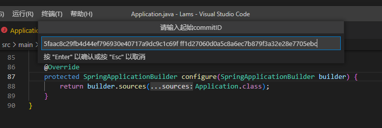
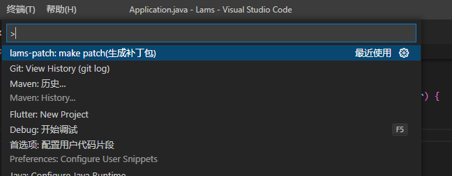
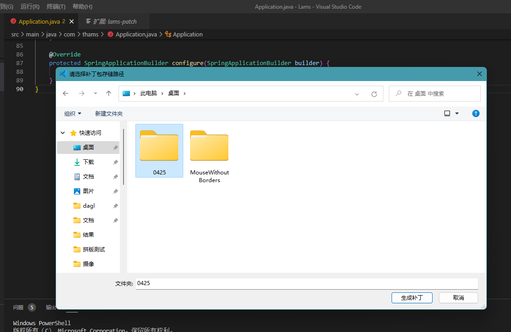
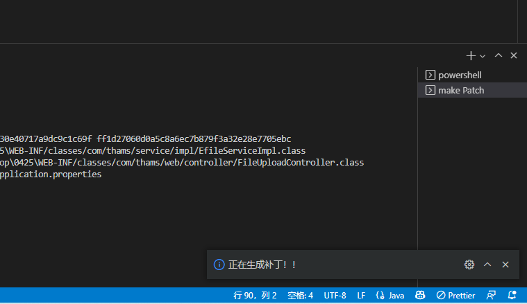

# lams-patch README

lams-path工具的vscode插件，通过命令窗口选择lams-path makePath 填入 旧commitId 和新commitId 然后选择生成补丁的目录即可

## Features

操作截图:
### 第一步选择命令

### 第二部输入commitId

### 第三步选择生成补丁的目录

### 执行结果

## 使用前提是安装了lams-path工具 

