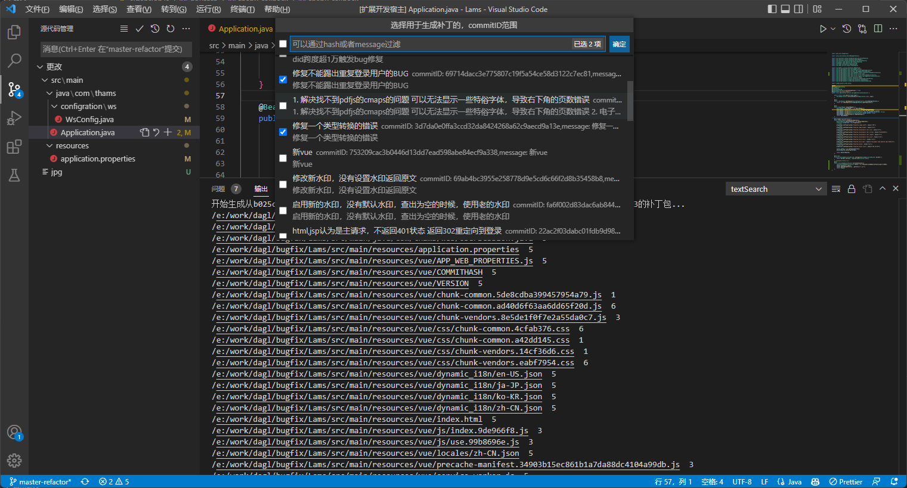

# lams-patch README

lams-path工具的vscode插件，通过命令窗口选择lams-path makePath 选择commitId和生成补丁的目录即可

## Features

操作截图:
### 第一步ctrl+F11直接打开或者ctrl+shift+p选patch 

### 第二步选择需要生成补丁的版本号commitId

### 第三步选择生成补丁的目录

 
